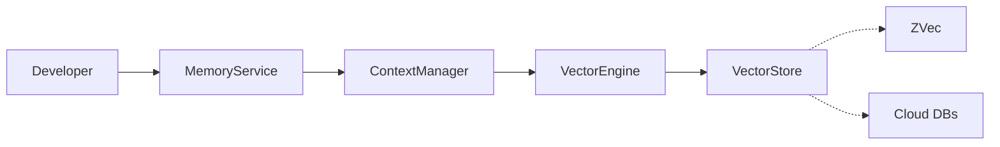

# Cortex

> Developer-controlled context memory layer for Effect applications

Cortex provides a type-safe, Effect-native way to store and retrieve vector embeddings. Built for AI/LLM applications requiring persistent context storage with semantic search.


> **⚠️ Active Development** - API may change. Follow [docs/prd.md](./docs/prd.md) for progress.


## Install

```bash
bun add @thaletto/cortex
```

## Usage

```typescript
import { Effect } from "effect";
import { MemoryService } from "@thaletto/cortex";

const program = Effect.gen(function* () {
  const memory = yield* MemoryService;

  // Store context with developer-provided ID
  yield* memory.add({
    id: "user-123",
    content: "User prefers TypeScript over JavaScript",
    category: "preferences"
  });

  // Search for relevant context
  const results = yield* memory.search({
    queryText: "programming language preferences",
    options: { category: "preferences", limit: 5 }
  });

  console.log(results);
});

// Provide layers and run
Effect.runPromise(program.pipe(Effect.provide(MemoryService.Default)));
```

## Features

- **Explicit storage** — you control what and when to store
- **Semantic search** — vector similarity with filters
- **Type-safe** — full TypeScript with Effect Schema
- **TTL support** — optional expiration on entries
- **Pluggable** — swap vector stores or embedding providers

## API

### MemoryService

| Method | Description |
|--------|-------------|
| `add(input)` | Store a single context entry |
| `addMany(inputs)` | Batch store multiple entries |
| `search(options)` | Semantic search with filters |
| `searchMany(queries)` | Batch search multiple queries |
| `delete(id)` | Remove entry by ID |
| `query(filter)` | Filter entries without vector search |

### EmbeddingService

Bring your own embeddings:

```typescript
import { Layer, Effect } from "effect";
import { EmbeddingService } from "@thaletto/cortex";

const MyEmbeddings = Layer.effect(EmbeddingService, Effect.gen(function* () {
  return {
    embed: (text: string) => Effect.succeed(/* your embedding logic */)
  };
}));
```

## Architecture



## Status

Early development. See [docs/prd.md](./docs/prd.md) for progress.

## License

MIT
