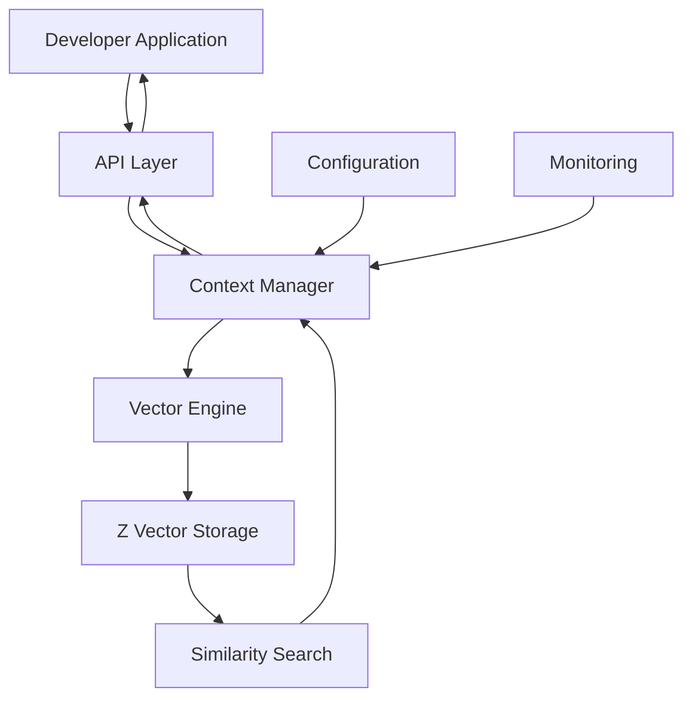

# PRD: Cortex (Effect Memory Layer)

## 1. Problem Statement

**Problem:** Effect developers need a **developer-controlled context memory system** for:
- AI/LLM applications requiring persistent context storage
- Applications needing semantic memory retrieval
- Developer-explicit memory management (not automatic state persistence)
- Type-safe context storage with similarity search capabilities

**Current Pain Points:**
- Manual context management in AI applications
- No native Effect solution for semantic memory
- Complex integration with vector databases for context
- Lack of developer-controlled memory patterns

## 2. Proposed Solution

**Product:** `@thaletto/cortex` - A developer-controlled context memory layer for Effect applications

### Core Features:
- **Explicit Context Storage**: Developers choose what to store and when
- **Semantic Memory**: Vector search for retrieving related context
- **Developer API**: Simple methods to add, search, and manage context
- **Type Safety**: Full TypeScript support with Effect Schema
- **Performance**: Optimized for Effect async patterns

### Developer Experience:
```typescript
import { Memory } from "@thaletto/cortex"

// Developer explicitly stores context
const storeContext = await Memory.add({
  id: "user-123",
  content: "User prefers TypeScript over JavaScript",
  category: "user-preferences"
})

// Developer searches for related context
const relevantContext = await Memory.search("user programming preferences")
```

## 3. Architecture

### High-Level Architecture:
```
┌─────────────────────────────────────────────────────────────────────────┐
│                           Effect Library                                │
│                           (`npm` package)                               │
├─────────────────────────────────────────────────────────────────────────┤
│                       @thaletto/cortex Package                          │
├─────────────────────────────────────────────────────────────────────────┤
│  ┌─────────────────┐  ┌─────────────────┐  ┌─────────────────┐          │
│  │   Effect Layer  │  │ Context Manager │  │ Vector Engine   │          │
│  │                 │  │                 │  │                 │          │
│  │ • add()         │  │ • Lifecycle     │  │ • Z Vector DB   │          │
│  │ • search()      │  │ • Cache Mgmt    │  │ • Similarity    │          │
│  │ • delete()      │  │ • Indexing      │  │ • Storage       │          │
│  │ • query()       │  │ • Validation    │  │ • Performance   │          │
│  └─────────────────┘  └─────────────────┘  └─────────────────┘          │
├─────────────────────────────────────────────────────────────────────────┤
│                              Data Flow                                  │
│  1. Effect      →         2. Context Manager   → 3. Vector Engine       │
│     (add/search/delete)   (processing)         (storage/retrieval)      │
│                                                                         │
│  Developer Actions:                                                     │
│  • Store explicit context (user preferences, chat history, etc.)        │
│  • Search semantic context (find related information)                   │
│  • Manage context lifecycle (cleanup, expiration)                       │
└─────────────────────────────────────────────────────────────────────────┘
```

### Detailed Component Breakdown:

#### 1. **API Layer** (Developer Interface)
```typescript
// Main entry point for developers
interface MemoryContext {
  add(context: ContextInput): Effect<ContextId, MemoryError>
  search(query: string, options?: SearchOptions): Effect<Array<Context>, MemoryError>
  delete(id: ContextId): Effect<void, MemoryError>
  query(filter: ContextFilter): Effect<Array<Context>, MemoryError>
}

interface ContextInput {
  id?: ContextId           // Optional auto-generated ID
  content: string          // The context content to store
  category: string         // User-defined category (e.g., "user-prefs", "chat")
  metadata?: Record<string, any>  // Additional metadata
  tags?: string[]         // Search tags
  ttl?: Duration         // Time-to-live (optional)
}
```

#### 2. **Context Manager** (Effect Business Logic)
```typescript
// Effect service layer managing context lifecycle
class ContextManager {
  private cache: Effect<Map<ContextId, Context>>
  private indexer: Effect<ContextIndex>
  
  // Effect-based operations
  storeContext(input: ContextInput): Effect<ContextId, MemoryError>
  retrieveContext(id: ContextId): Effect<Option<Context>, MemoryError>
  searchContext(query: string): Effect<Array<Context>, MemoryError>
  cleanupExpired(): Effect<void, MemoryError>
}
```

#### 3. **Vector Engine** (Z Vector Integration)
```typescript
// Low-level vector operations using Z Vector
interface VectorEngine {
  // Storage operations
  storeVector(id: string, vector: Float32Array, metadata: any): Effect<void, VectorError>
  searchVector(query: Float32Array, limit: number): Effect<Array<VectorResult>, VectorError>
  deleteVector(id: string): Effect<void, VectorError>
  
  // Vector operations
  embed(text: string): Effect<Float32Array, EmbeddingError>
  calculateSimilarity(a: Float32Array, b: Float32Array): Effect<number, Error>
}
```

#### 4. **Data Flow Architecture**


### Key Design Decisions:

#### **Memory Organization:**
- **Categories**: Developer-defined context types (user-prefs, chat-history, app-state)
- **Metadata**: Flexible key-value pairs for context organization
- **Tags**: Simple text tags for additional filtering
- **TTL**: Optional expiration for time-sensitive context

#### **Search Strategy:**
- **Semantic Search**: Vector similarity for content-based retrieval
- **Category Filtering**: Filter by context type
- **Tag Matching**: Text-based tag filtering
- **Hybrid Search**: Combined semantic + categorical search

#### **Performance Considerations:**
- **Caching**: Effect-based caching for frequently accessed context
- **Batch Operations**: Efficient bulk storage/retrieval
- **Indexing**: Optimized for fast similarity search
- **Memory Management**: Automatic cleanup and quota management

#### **Error Handling:**
- **Effect Either**: Proper error handling using Effect Either type
- **Validation**: Input validation at API layer
- **Graceful Degradation**: Fallback strategies for vector operations
- **Monitoring**: Comprehensive logging and metrics

## 4. Actors Involved

### Technologies:
- **Language**: TypeScript (ES2022+)
- **Framework**: Effect
- **Vector Engine**: Z Vector (Alibaba)
- **Testing**: Effect Testing, Vitest
- **Build**: TypeScript, Rollup

### Dependencies:
```json
{
  "effect": "^latest",
  "zvec": "^1.0.0",
  "effect-schema": "^latest"
}
```

### Target Users:
- Effect developers building AI/LLM applications
- Teams needing context persistence
- Chatbot and agent developers
- Applications requiring semantic memory

## 5. Project Plan

### Phase 1: Core Context API (Weeks 1-3)
- [ ] Setup project structure and build system
- [ ] Integrate Z Vector engine
- [ ] Create basic context storage interface
- [ ] Implement add/search/delete operations
- [ ] Add Effect integration patterns

### Phase 2: Context Management (Weeks 4-5)
- [ ] Implement context categorization
- [ ] Add context metadata and tags
- [ ] Create context search with filters
- [ ] Add context expiration policies
- [ ] Implement context relationships

### Phase 3: Developer Experience (Weeks 6-7)
- [ ] Create comprehensive documentation
- [ ] Add AI application examples
- [ ] Implement configuration system
- [ ] Add error handling and logging
- [ ] Create test suite

### Phase 4: Polish & Release (Week 8)
- [ ] Performance optimization
- [ ] Package publication
- [ ] GitHub setup
- [ ] Community outreach
- [ ] Feedback collection

### Success Metrics:
- [ ] Package published with AI application examples
- [ ] GitHub stars >50
- [ ] Positive developer feedback
- [ ] Zero critical bugs in production

## 6. Key Differentiators

### Why This Package?
- **Developer Control**: Explicit context storage, not automatic state persistence
- **Effect Native**: Built specifically for Effect patterns and ecosystem
- **Lightweight**: In-process vector database (Z Vector) for optimal performance
- **Type-Safe**: Full TypeScript integration with Effect Schema
- **Flexible**: Supports various context types and search strategies

### Competitors:
- **Generic Vector DBs**: Complex setup, not framework-specific
- **Manual Implementation**: Time-consuming, error-prone
- **Other Memory Libraries**: Lack Effect integration or developer control

## 7. Risks & Mitigation

### Technical Risks:
- **Z Vector Dependency**: Fallback to FAISS/ChromaDB if needed
- **Memory Management**: Comprehensive testing and monitoring
- **Performance Issues**: Early profiling and optimization

### Project Risks:
- **Scope Creep**: Strict 8-week timeline with clear phases
- **Effect Compatibility**: Test with multiple versions
- **Adoption**: Focus on AI/Effect community for initial users

---

**Estimated Timeline**: 8 weeks (2 months)
**Target Audience**: Effect developers building AI applications
**Launch Goal**: Production-ready package with comprehensive documentation and examples